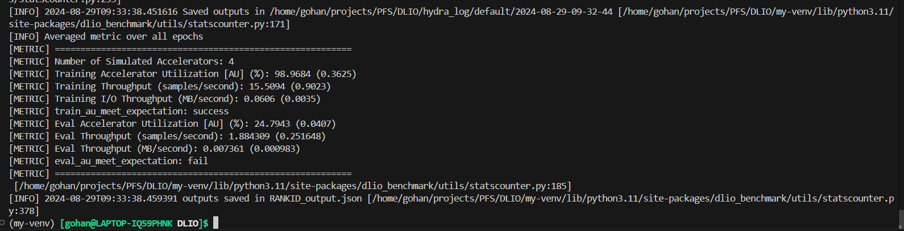

# DaSH-Lab-Assignment-2024

## Development Assignment

### Level 1
I decided to use Groq's `llama3-70b-8192` because I heard that it was more accurate out of the free APIs available. I made a virtual environment, after which I installed `groq` and `python-dotenv`. I tested making an API call to the LLMusing a hardcoded prompt, following the [GroqCloud documentation](https://console.groq.com/docs/text-chat). The code for this is in `Level1Test.py`, under the `Development-Assignment` directory.

Once the API call part was working, I wrote code for the final program . This program (as required) takes input from a text file and outputs a JSON array of objects. The output.json file that the program (`Level1Final.py`) outputted is present in the same directory along with the `input.txt` file.

## Project Based Assignment (Parallel File Systems)

### Level 1
Reading both papers gave me an idea of how BeeGFS works in more detail, and the current issues surrounding I/O in the context of HPC.

### Level 2: DLIO Benchmark
DLIO Benchmark runs with MPI, so I first installed `openmpi` (v5.0.5). I then created a new folder for DLIO and created a virtual environment using `venv`. To install the DLIO Benchmark, I followed the instructions on the [DLIO documentation](https://dlio-benchmark.readthedocs.io/en/latest/install.html) to install DLIO. I cloned the repository using Git and then used `pipx` to install it. After this, I generated the data to run the benchmark on using the command:


```
mpirun -np 4 dlio_benchmark workload=default ++workload.workflow.generate_data=True ++workload.workflow.train=False
```


I then used 
```
mpirun -np 4 dlio_benchmark workload=default ++workload.workflow.generate_data=False ++workload.workflow.train=True ++workload.workflow.evaluation=True
```
to run the benchmark on the default configuration. This both trains the model and runs the model on the evaluation data. The below image shows the output after the training and evaluation was finished.



From these statistics, clearly the I/O is much slower for the evaluation data as compared to the training data.

The logs from this run are in the `PFS-Assignment` directory under `DLIO_log`.

### Level 3: Darshan Trace

I followed the instructions to install `darshan-runtime` from the website. I downloaded and extracted the archive and then ran the `prepare.sh` script inside the folder. Then I configured the installation, setting the path for the logs to a directory that I created.  Finally, I ran `make` and `make install`. I also ran `darshan-mk-log-dirs.pl` which created directories by month and year for storing logs. To run a trace on a program, I needed to enable the DXT module, which I did by running `export DXT_ENABLE_IO_TRACE=1`.

To make sense of the logs, I needed `darshan-util`. For installing it, I followed a similar process. I first went into the `darshan-util` directory and configured the installation, followed by `make` and `make install`.

To run the trace, I first had to compile it. I did this with MPI, and dynamically linked darshan. My compile command was:


```
mpicxx example1.cpp -L/usr/local/lib -Wl,-rpath=/usr/local/lib -Wl,-no-as-needed -ldarshan
```

I decided to go with dynamic linking because the size of the executable generated is smaller, although in this case it doesn't really matter, I could have gone with static linking as well.

Then I ran the executable generated. The executable created 5 files and wrote "AAAAAAAAAAAAAAAAAAAAAAAAAAAAAAAAA" (with 1024 As) to each of them (lol). Darshan is used here to trace the I/O of the program to the newly created files. The log was also generated after the executable finished running.

Finally, I used the `darshan-dxt-parser` tool to read the logs. The output of this is in the `PFS-Assignment` directory under `Darshan_log` along with the log file itself.
